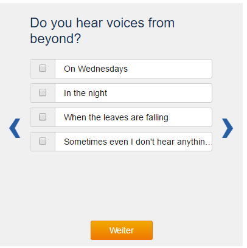

# Questionnaire
Create a Questionnaire Slider with Step Logic

## Functions
* Consume a JSON object to display a dynamic questionnaire
* The view contains
  * The question
  * Multiple answers
  * A next -button
  * Two arrow control-buttons
  * Static html
* Switch between question steps with next and previous arrow button
* A success page with static content is displayed at the end
* Given answers can affect following questions

## Notes
* Questions and pages are combined to steps
* Questions can have single or multiple answers
* Every step has a UUID
* Answers affecting next questions:
  * If so, a pointer to the following question can be read from the 'next' (step-UUID) field
* A required-flag can be set to prevent skipping unanswered questions
* Do not care about dubious keys in JSON object :)

## Requirements
* All code, configs and docs should be pushed to the provided git repository
* All setup should be done via a package manager (bower, node, etc..)
* Write a markdown-file with installation instructions, if needed
* Use gitattribute or editorconfig for project setup
* Use Gulp as build processor
* Use JavaScript as programming language, ES2015 is preferred
* There are no requirements on using a specific js-framework
* Write some unit tests for logic method, no full test coverage needed.
* Integrate Twitter Bootstrap
* Use SASS as style pre-processer
* Selecting Text should completely be disabled
* Create a distribution directory as document root, run webserver pointing to this root
* CSS and JS should be minified
* Use Glyphicons as control icons

## Nice to have
* Use TypeScript
* Serve JSON content from a http server
* Use promises (done, fail, …) to process responses
* Use Font-Awsome instead of Glyphicons